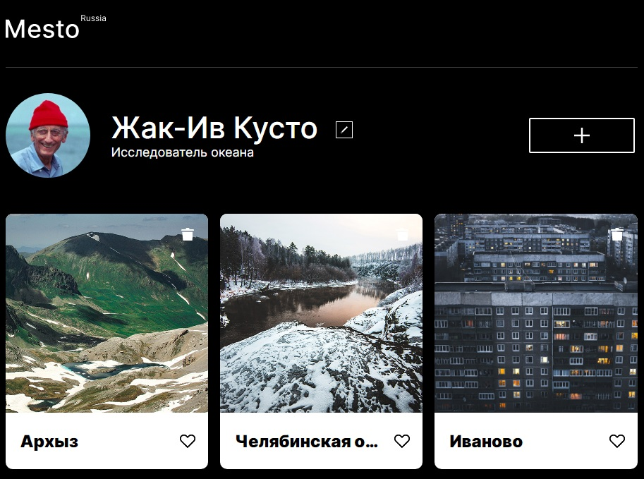

# Проект:

## Осваиваем JavaScript
### А так же закрепляем CSS

1. Реализована адаптивная верстка согласно макета: [Макет в Figma](https://www.figma.com/file/2cn9N9jSkmxD84oJik7xL7/JavaScript.-Sprint-4?node-id=0%3A1)

2. К проекту подключен JS реализующий следующие функции:

* Открытие и закрытие модального окна "popup",
* Редактирование блока с профилем через модальное окно.

## Ознакомится с проектом можно по ссылке:
[Ссылка в GitHub](https://dmitry2011.github.io/mesto/index.html)

#### Знакомство с JS прошло не просто...
