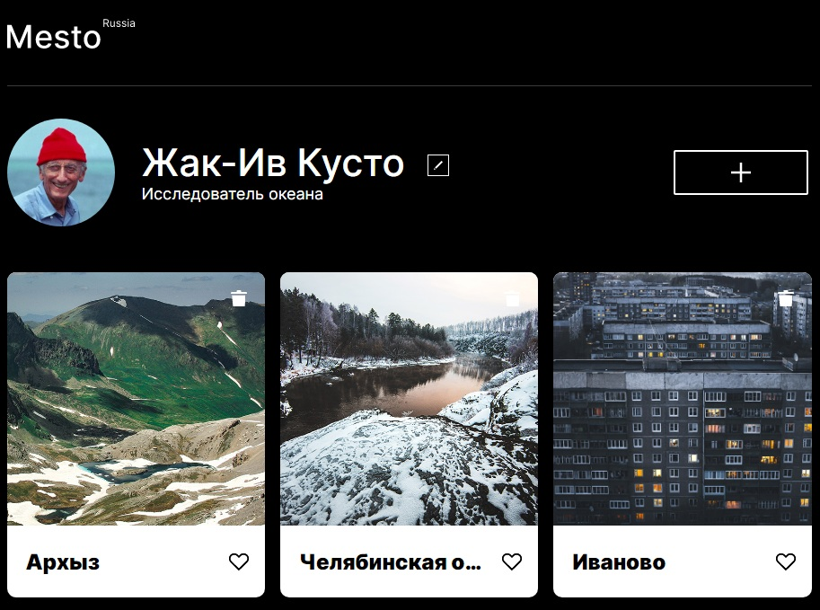

# Проект:

## Осваиваем JavaScript ООП а так же осваеваем запросы на сервер
### А так же закрепляем CSS

1. Реализована адаптивная верстка согласно макета: [Макет в Figma](https://www.figma.com/file/2cn9N9jSkmxD84oJik7xL7/JavaScript.-Sprint-4?node-id=0%3A1)
  * а так же реализованы модальные окна согласно [Макет в Figma](https://www.figma.com/file/bjyvbKKJN2naO0ucURl2Z0/JavaScript.-Sprint-5?node-id=0%3A1) и [Макет в Figma](https://www.figma.com/file/PSdQFRHoxXJFs2FH8IXViF/JavaScript.-Sprint-9?node-id=0%3A1)
  * добавлена валидация форм модальных окон.

2. К проекту подключен JS реализующий следующие функции:

* Открытие и закрытие модальных окон (закрытие по Esc и клику вне модального окна)
* Редактирование блока с профилем через модальное окно,
* Добавление новых карточек,
* Удаление старых карточек,
* Отметка "Лайк" понравившейся карточки,
* Просмотр картинки круаным планом через модальное окно.

3. Код JS объектно - ориентирован, разбит на классы.

4. Все модальные окна открываются и закрываются плавно.

5. Реализован обмен данными с сервером:

* Сайт получает данные о пользоветеле и крточки с картинками с сервера,
* У пользователя есть возможность отредактировать имя, аватар и специфику своей занятости с последующим сохранением инфо на сервере,
* Пользователь может добавлять новые карточки с картинками и сохранять их на сервер, а также может удалить созданные им карточки с сервера,
* Пользователь может отметить понравившиеся карточки с картинками "лайком", отметка сохранится на сервере.

## Ознакомится с проектом можно по ссылке:
[Ссылка в GitHub](https://dmitry2011.github.io/mesto/)

#### Продолжаем знакомится с JS...
